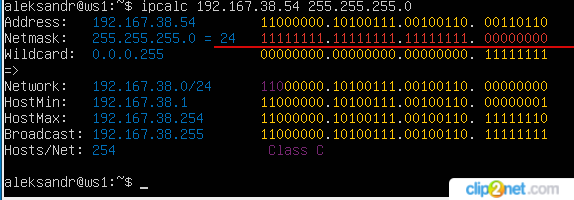
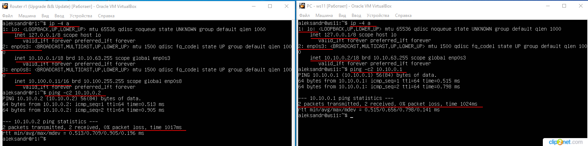

## Part 1. ipcalc tool ##

Запустил виртуальную машину, переименовал с user-1 на ws1.

*рис. 1 Переименование виртуальной машины*

1.1. Сети и маски

Установил ipcalc - программа предназначенная для вычисления широковещательного адреса, диапазона хостов, шаблона сетевой маски по IP адресу и сетевой маске. Может использоваться для конструирования сетей и подсетей.

I. Определил адрес сети 192.160.38.54/13  - 192.160.0.0

*рис. 2 Адрес сети 192.167.38.54/13*

II. Перевёл маски в обычную, префиксную и двоичную запись

Перевёл маску 255.255.255.0 в префиксную и двоичную запись
  * 255.255.255.0 - в префиксной записи 24
  * 255.255.255.0 - в двоичной записи 11111111.11111111.11111111.00000000

*рис. 3 Маска 255.255.255.0*

Перевёл маску /15 в обычную и двоичную запись
  * /15 - в обычной записи 255.254.0.0
  * /15 - в двоичной записи 11111111.11111110.00000000.00000000

*рис. 4 Маска /15*

Перевёл маску 11111111.11111111.11111111.11110000 в обычную и префиксную запись. В двоичном отображении маска подсети выглядит: 11111111.11111111.11111111.11110000 - содержит 28 единиц, едентична записи /28

  * 11111111.11111111.11111111.11110000 - в обычной записи 255.255.255.240
  * 11111111.11111111.11111111.11110000 - в префиксной записи 28

*рис. 5 Маска 11111111.11111111.11111111.11110000 (/28)*

III. Определил минимальный и максимальный хост в сети 12.167.38.4

 * минимальный хост при маске /8 - 12.0.0.1
 * максимальный хост при маске /8 - 12.255.255.254

*рис. 6 Минимальный и максимальный хост при маске /8*

  * минимальный хост при маске 11111111.11111111.00000000.00000000 - 12.167.0.1
  * максимальный хост при маске 11111111.11111111.00000000.00000000 - 12.167.255.254

*рис. 7 Минимальный и максимальный хост при маске 11111111.11111111.00000000.00000000*

  * минимальный хост при маске 255.255.254.0 - 12.167.38.1
  * максимальный хост при маске 255.255.254.0 - 12.167.39.254

*рис. 8 Минимальный и максимальный хост при маске 255.255.254.0*

  * минимальный хост при маске /4 - 0.0.0.1
  * максимальный хост при маске /4 - 15.255.255.254

*рис. 9 Минимальный и максимальный хост при маске /4*

1.2. localhost

localhost - "общеизвестное" имя компьютера для самого себя и ему соответствует IP адрес 127.0.0.1. Сервер на моём компьютере – это и есть localhost.
Запросы на данный IP адрес 127.0.0.1. не будут перенаправляться в Интернет, TCP/IP с первого блока (127) определяет, что мы не хотим выходить в интернет, а "звоним" сами, появляется петля. localhost применяется для тестирования программ и веб-приложений, для проверки сетевых подключений, файл hosts используется для блокировки вредоносных сайтов.

**ВЫВОД. К приложению, работающему на localhost обратиться по IP адресам: 194.34.23.100, 128.0.0.1 - НЕЛЬЗЯ, по IP адресам: 127.0.0.2, 127.1.0.1 - МОЖНО!**

1.3. Диапазоны и сегменты сетей

* Частные IP-адреса предназначены для использования в частных сетях (домашние, офисные) для идентификации устройства в сети. Они совпадают с общедоступными IP-адресами на уровне протокола, однако отличаются организационно. Эти адреса не действительны в интернете, они могут использоваться только в рамках одной администрации.

* Диапазоны IP для частных адресов:
   * Класс A: начальный адрес - 10.0.0.0 конечный адрес - 10.255.255.255
   * Класс B: начальный адрес - 172.16.0.0 конечный адрес - 172.31.255.255
   * Класс C: начальный адрес - 192.168.0.0 конечный адрес - 192.168.255.255

* Все другие IP-адреса - публичные. Публичные IP адреса (уникальные) используется для идентификации домашней сети с внешним миром (в Интернете или другой глобальной сети).

Можно проверить с помощью утилиты ipcalc, проверяя каждый адрес.

*рис. 10 Данные сети 10.0.0.45*

*рис. 11 Данные сети 134.43.0.2*

В качестве **частных IP адресов** можно использовать: 10.0.0.45, 10.10.10.10, 172.16.255.255, 172.20.250.4, 192.168.4.2.
В качестве **публичных IP адресов** можно использовать: 134.43.0.2, 172.0.2.1, 172.68.0.2, 192.169.168.1, 192.172.0.1.

* IP адресов шлюза (сетевого разъёма, конвертера протоколов) - IP адрес сетевого устройства, которое действует как точка входа из одной сети в другие сети.

*рис. 12 Минимальный и максимальный хост при маске /4*

У сети 10.10.0.0/18 **возможны** следующие IP адреса шлюза: 10.10.0.2, 10.10.1.255, 10.10.10.10.
У сети 10.10.0.0/18 **не возможны** следующие IP адреса шлюза: 10.0.0.1, 10.10.100.1.

## Part 2. Static routing between two machines ##

Методом клонирования создал вторую виртуальную машину, переименовал её в ws2. В общих настройках (инструменты -> настройки -> файл -> сеть) добавил новую NAT сеть. В настройках -> сеть каждой виртуальной машины, на адаптер 1 установил тип подключения внутренняя сеть.  В инструментах -> свойства VirtualBox Host-Only Ethernet Adapter включил настройку адаптера автоматически, включил DHCP сервер. 
С помощью команды ip a посмотрел существующие сетевые интерфейсы: 1: lo; 2: enp0s3; 3: eno0s8.

*рис. 13 Cетевые интерфейсы виртуальных машин ws1, ws2*

**Cетевые интерфейсы**
* lo — это (внутренний) петлевой адрес, используемый для подключения по сети к этому же компьютеру, не требует дополнительной настройки.
  * lo: Имя сетевого интерфейса в виде строки.
  * <LOOPBACK,UP,LOWER_UP>: LOOPBACK - петлевой интерфейс. UP - означает, что интерфейс работает. LOWER_UP - физический сетевой уровень (первый уровень) также работает.
  * mtu 65536: максимальная единица передачи. Это размер наибольшего фрагмента данных, который может передавать этот интерфейс.
  * qdisc noqueue: qdisc — это механизм организации очередей. Планирует передачу пакетов. Существуют различные методы очередей, называемые дисциплинами. Дисциплина noqueue означает «отправляй мгновенно, не ставь в очередь». Это стандартная дисциплина qdisc для виртуальных устройств, например адресов LOOPBACK.
  * state UNKNOWN: могут быть такие состояния как DOWN (сетевой интерфейс не работает), UNKNOWN (сетевой интерфейс работает, но ничего не подключено) или UP (сеть работает и соединение установлено).
  * group default: интерфейсы могут быть сгруппированы логически. По умолчанию они помещаются в группу под названием «default».
  * qlen 1000: максимальная длина очереди передачи.
  * link/loopback: адрес управления доступом к среде (MAC) интерфейса.
  * inet 127.0.0.1/8: IP-адрес версии 4. Часть адреса после косой черты (/) представляет собой нотацию бесклассовой междоменной маршрутизации (CIDR), представляющую маску подсети. Она указывает, сколько ведущих непрерывных битов имеют значение единица в маске подсети. Значение восемь означает восемь битов. Восемь битов, равных единице, представляют 255 в двоичном виде, поэтому маска подсети равна 255.0.0.0.
  * scope host: область IP-адреса. Этот IP-адрес действителен только внутри компьютера («хост»).
  * lo: интерфейс, с которым связан этот IP-адрес.
  * valid_lft: допустимое время жизни. Для IP-адреса версии 4 IP, назначенного протоколом динамической конфигурации хоста (DHCP), это период времени, в течение которого IP-адрес считается действительным и может создавать и принимать запросы на подключение.
  * preferred_lft: предпочтительное время жизни. Для IP-адреса версии 4, выделенного протоколом DHCP, это количество времени, в течение которого IP-адрес может использоваться без ограничений. Оно никогда не должно быть больше значения valid_lft.
  * inet6: IP-адрес версии 6, оvalid_lft и preferred_lft смотри выше.
* enp0s3 — конфигурируемый офизический интерфейс проводного сетевого подключения «en» обозначает Ethernet, «p0» - номер шины карты Ethernet, а «s3» - номер слота;
* enp0s8 — аналогично enp0s3.

В редакторе nano изменил файлы etc/netplan/00-installer-config.yaml для виртуальных машин ws1, ws2.

*рис. 14 Изменение конфигурационных файлов виртуальных машин ws1, ws2*

Выполнил команду netplan apply данная команда применяется для перечитывания настроек и перезапуска сети (вместо restart и reload).

*рис. 15 Kоманда netplan apply для перезапуска сервиса сети*

2.1. Добавление статического маршрута вручную

Добавил статические маршруты от виртуальной машины ws1 к ws2 и от ws2 к ws 1 при помощи команды вида ip r add.

*рис. 16 Добавление статических маршрутов*

Пропинговал соединение между машинами ws1 и ws2 отправкой 5 пакетов.

*рис. 17 Пингование машин ws1, ws2*

2.2. Добавление статического маршрута с сохранением

После перезапуска машин маршруты не сохранились. При отправки 5 пакетов с машины ws1 они все потеряны (100% loss), при отправке пакетов с машины ws2 - сеть не найдена.

*рис. 18 Пингование машин ws1, ws2*

Добавил статический маршрут от одной машины до другой изменив в редакторе nano файлы двух виртуальных машин ws1, ws2 sudo nano /etc/netplan/00-installer-config.yaml

*рис. 19 Изменённые файлы 00-installer-config.yaml*

Для применения настроек запустил команду sudo netplan apply. Пропинговал соединение между машинами ws1 и ws2 отправкой 5 пакетов.

*рис. 20 Пингование машин ws1, ws2*

Для повторной проверки перезапустил виртуальные машины и пропинговал их ещё раз отправкой 5 пакетов.

*рис. 21 Пингование машин ws1, ws2*

## Part 3. iperf3 utility ##

3.1. Скорость соединения

Быстроту передачи данных принято измерять в битах/сек, используют также килобиты (1 Килобит = 1024 бит) или мегабиты (1 Мегабит = 1024 килобит).
Современное определение килобайта - 1000 байт, т.к. префикс кило- всегда означает 1000. Но ранее было принято считать, что в килобайте 1024 байта.
Перевёл скорость интернета из одних единиц в другие:
  * 8 Mbps = 1 MB/s (old) = 1 MB/s (new);
  * 100 MB/s = 819200 Kbps (old) = 800000 Kbps (new);
  * 1 Gbps = 1024 Mbps (old) = 1000 Mbps (new).

3.2. Утилита iperf3

iperf3 — кроссплатформенная консольная клиент-серверная программа — генератор TCP и UDP трафика для тестирования пропускной способности сети, проведения нагрузочного тестирования канала связи. Тестирование проводил на двух виртуальных машинах ws1 (клиент), ws2 (сервер iperf3 -s).
Далее на компьютере клиенте (ws1) ввёл iperf3 -c 172.24.116.8 (IP адрес сервера ws2). На протяжении 10 секунд между этими машинами проходил обмен трафиком, пропускная способность составила 2.61 Гбит/с (сервер и клиент запускались на одном компьютере).

*рис. 22 Трафик и скорость соединения между ws1 и ws2.*

Максимальное среднее значение пропускной способности между двумя виртуальными машинами ws1 и ws2 при передачи 3.04 GBytes (Гбайт) составила 2.61 GBits/sec (Гбит/сек).

## Part 4. Network firewall ##

4.1. Утилита iptables

В ядро операционной системы Linux встроен фаервол (сетевой экран) iptables - программа выполняющая защиту системы от внешних вторжений, также она осущестляет перенаправление портов и др. iptables — совокупность базовых и пользовательских цепочек, объединённых общим функциональным назначением. В системе netfilter, пакеты пропускаются через цепочки. Цепочка является упорядоченным списком правил, а каждое правило может содержать критерии и действие или переход. Когда пакет проходит через цепочку, система netfilter по очереди проверяет, соответствует ли пакет всем критериям очередного правила, и если так, то выполняет действие (если критериев в правиле нет, то действие выполняется для всех пакетов проходящих через правило). Вариантов возможных критериев очень много. Например, пакет соответствует критерию –source 192.168.100.10 если в заголовке пакета указано, что отправитель — 192.168.100.10. Самый простой тип перехода, –j (jump), просто пересылает пакет в начало другой цепочки. Также при помощи –jump можно указать действие. Стандартные действия доступные во всех цепочках — ACCEPT (пропустить), DROP (удалить), QUEUE (передать на анализ внешней программе), и RETURN (вернуть на анализ в предыдущую цепочку). Например, команды

iptables -A INPUT --source 192.168.1.1 --jump ACCEPT
iptables -A INPUT --jump other_chain
означают «добавить к концу цепочки INPUT следующие правила: пропустить пакеты из 192.168.1.1, а всё, что останется — отправить на анализ в цепочку other_chain».

*рис. 23 Диаграмма прохождения таблиц и цепочек*

Создал файлы /etc/firewall.sh, имитирующие сетевой экран, на виртуальных машинах ws1 и ws2

*рис. 24 Файлы firewall.sh на ws1 и ws2*

Предоставил право владельцу (себе) на выполнение скрипта, запустил скрипты, пропинговал две виртуальные машины.

*рис. 25 Запуск скриптов на ws1 и ws2*

Стратегия (описание скрипта).
По умолчанию используется таблица filter, которая содержит цепочки INPUT, FORWARD и OUTPUT. Для очистки таблиц применил ключи X, F. Добавил новое правило в конец заданной цепочки iptables -A INPUT. Фильтрацию входящего трафика - разрешил по протоколам tcp (могут быть протоколы TCP, UDP и ICMP) соединение с удалённым компьютером ssh на порт 22 и соединение с веб и файловыми сервисами web.http на порт 80 (-p tcp --dport 22 -j ACCEPT). После приёма пакета данных клиенты (ws1, или ws2) отвечают пакетом Echo Reply (эхо-запросы (Echo Request или 8) и эхо-ответы (Echo Reply или 0) применяются для проверки активности системы) c действием REJECT для "сбрасывания" пакета данных и iptables "забывает" о его существовании. ws1 - "забывает" соединение с удалённым компьютером по ssh на порт 22, и соединение с  веб и файловыми сервисами web.http на порт 80, так как если запрещающее правило идёт ранее, оно не отменяется разрешающим правилом.

4.2. Утилита nmap

Пропинговав ws1 и ws2 я выяснил, что ws1 не пингуется.

*рис. 26 Просканировал сети ws1 - 192.168.100.10, ws2 - 172.24.116.8*

nmap - сканер сети, позволяет понять какие компьютеры подключены к сети, узнать их имена, посмотреть какое программное обеспечение на них установлено, какая операционная система и какие типы фильтров применяются.
Суть работы всех сетевых программ основана на портах. Чтобы получить сообщение из сети, программа должна открыть порт на вашем компьютере и ждать входящих соединений. А для отправки сообщения по сети нужно подключиться другой программой (адресатом) к другому порту. Затем программе необходимо будет открыть порт, на котором она будет ждать ответа.
nmap при сканирования сети перебирает доступный диапазон портов и пытается подключиться к каждому из них. Если подключение удалось, программа отправляет нужные пакеты и смотрит какие хосты (IP адреса или домены) прислали ответ, программа может даже узнать версию программного обеспечения, которые ожидает подключений к этому порту.

Сохранил дампы образов виртуальных машин ws1 и ws2.

*рис. 27 Дамп образа VM ws1*

## Part 5. Static network routing ##

Согласно схемы поднял пять виртуальных машин (3 рабочие станции (ws11, ws21, ws22) и 2 роутера (r1, r2)).

*рис. 28 Network*

5.1. Настройка адресов машин

Настроил конфигурации машин в файлах конфигурации etc/netplan/00-installer-config.yaml согласно схемы, применил конфигурацию настройки сети (sudo netplan apply).

*рис. 29 Файлы 00-installer-config.yaml VM Router -r1, PC -ws11*

*рис. 30 Файлы 00-installer-config.yaml VM Router -r2, PC -ws21, PC -ws22*

Вручную перезапустил сервис сети, вывел короткую запись о IP адресах машин (ip -4), пропинговал VM Router -r1, PC -ws11 (ping -c 2).

*рис. 31 IP адреса VM Router -r1, PC -ws11 и их взаимное пингование VM*

Вывел короткую запись о IP адресах машин (ip -4), пропинговал VM Router -r2, PC -ws21, PC -ws22 (ping -c 2).

*рис. 32 IP адреса VM Router -r2, PC -ws21, PC -ws22 и их взаимное пингование VM*

5.2. Включение переадресации IP-адресов.

Включил переадресацию IP адресов, выполнил команду на роутерах sysctl -w net.ipv4.ip_forward=1. При таком подходе переадресация не будет работать после перезагрузки системы.

*рис. 33 Вызов и вывод результата после sysctl -w net.ipv4.ip_forward=1*

Переадресацию IP адресов сделал на постоянной основе, в файлах /etc/sysctl.conf раскоментировал (включил) net.ipv4.ip_forward = 1

*рис. 34 Содержание изменённых файлов sysctl.conf*

5.3. Установка маршрута по-умолчанию

Настроил маршрут (шлюз) по-умолчанию  для рабочих станций, в файлах конфигураций VM ws 11, ws21, ws22 (etc/netplan/00-installer-config.yaml) добавил gateway4 [ip Router]. Применил конфигурацию настройки сети (sudo netplan apply).

*рис. 35 Cодержание файлов etc/netplan/00-installer-config.yaml*

Посмотрел IP адреса хостов с помощью DNS (ip r). 

*рис. 36 IP адреса хостов*

Пропинговал с ws11 роутер r2 проверил, что пингование произошло (tcpdump -tn -i eth1).
tcpdump - утилита проверяет заголовки пакетов TCP/IP и выводит одну строку для каждого из пакетов (Ctr + C или -с..). При выводе информации отключил: n - преобразование адресов и номеров портов в символьные имена, t -  вывод временных меток в каждой строке дампа. Включил v - вывод дополнительной информации: время жизни, идентификация, общая длина и параметры IP-пакета, дополнительные проверки целостности пакетов, такие как проверка контрольной суммы заголовка IP и ICMP. Для захвата пакетов, проходящих через интерфейс (enp0s8) использовал -i enp0s8.

*рис. 37 Пингование с ws11 роутер r2*

5.4. Добавление статических маршрутов

Добавил в VM Router r1 и r2 статические маршруты в файле конфигураций (etc/netplan/00-installer-config.yaml). Применил конфигурацию настройки сети (sudo netplan apply).

*рис. 38 Файлы конфигурации VM Router r1, r2*

Посмотрел IP адреса хостов с помощью DNS (ip r). 

*рис. 39 IP адреса хостов*

На VM ws11 запустил команды: ip r list 10.10.0.0/18 и ip r list 0.0.0.0/0 - список записей маршрута ядра.
  * в первом случае была получена маршрутизация для конкретной сети, так как в первой команде мы указали сеть и маску подсети (10.10.0.0/18);
  * во втором случае 0.0.0.0/0 - это маршрут по умолчанию в Интернет-протоколе версии 4 (IPv4) или нулевой адрес. Маска подсети (/0) фактически указывает все сети и является кратчайшим возможным совпадением. Поиск маршрута, который не соответствует ни одному другому правилу, возвращается к этому маршруту.

*рис. 40 Список записей маршрута ядра на VM PS -ws11*

5.5. Построение списка маршрутизаторов

Проверил заголовки пакетов TCP/IP и строки для двух пакетов tcpdump -c2 -tnv -i eth0s8. Более родробное описание утилиты смотри выше.

*рис. 41 Проверка заголовка пакетов TCP/IP VM Router r1*

При помощи утилиты traceroute построил список маршрутизаторов пути от VM PS -ws11  до VM PS -ws21. Команда traceroute использует UDP пакеты, она отправляет пакет с TTL(Time To Live продолжительность хранения записи DNS в кэше)=1 и смотрит адрес ответившего узла, дальше TTL=2, TTL=3 и так пока не достигнет цели. Каждый раз отправляется по три пакета и для каждого из них измеряется время прохождения. Пакет отправляется на случайный порт, который, скорее всего, не занят. Когда утилита traceroute получает сообщение от целевого узла о том, что порт недоступен трассировка считается завершенной.

*рис. 42 Путь от VM PS -ws11 до VM PS -ws21*

5.6. Использование протокола ICMP при маршрутизации

Запустил на  VM Route r1 перехват сетевого трафика, проходящего через eth (enp0s8) с помощью команды: tcpdump -n -i enp0s8 icmp (вывод только ICMP-пакетов с интерфейса enp0s8). Смотри выше значение утилиты tcpdump.

*рис. 43 Перехват сетевого трафика VM Router r1*

Пропинговал с PC -ws11 несуществующий IP адрес (10.30.0.111) с помощью команды: ping -c1 10.30.0.111

*рис. 44 Пингование с ws11*

## Part 6. Dynamic IP configuration using DHCP ##

Протокол DHCP — это стандартный протокол, позволяющий серверу динамически распределять IP-адреса и сведения о конфигурации клиентам, DHCP-сервер предоставляет клиенту следующие основные сведения:
  * IP-адрес;
  * маску подсети;
  * также могут быть предоставлены сведения об адресах серверов службы доменных имен (DNS) и адресах серверов службы имен Windows интернета (WINS). Системный администратор настраивает DHCP-сервер с параметрами, которые анализируются на клиенте.

Установил утилиту isc-dhcp-server - программа-сервер обеспечивающая передачу клиентам сведений необходимых для работы в сети TCP/IP, например его IP-адрес.

В файле /etc/dhcp/dhcpd.conf PC Route r2 настроил конфигурацию службы DHCP:
  * указал адрес маршрутизатора по-умолчанию, DNS-сервер и адрес внутренней сети;

  

  *рис. 45 Файл dhcpd.conf*

  * в файле resolv.conf прописал nameserver 8.8.8.8 (публичный сервер DNS от Google (Google Public DNS).

  

  *рис. 46 Файл resolv.conf*

На VM Router r2 перезагрузил службу DHCP командой systemctl restart isc-dhcp-server, PC ws21 командой reboot, получил IP адреса (ip a), пропинговал PC ws22 с PC ws21.

*рис. 47 Пингование, получение IP адресов*

Для PC ws11 в etc/netplan/00-installer-config.yaml указал MAC адрес (добавил строки: macaddress: 10:10:10:10:10:ba, dhcp4: true).

*рис. 48 Файл 00-installer-config.yaml PC ws11*

Настроил VM Router r1 аналогично VM Router r2, но сделал выдачу адресов с жесткой привязкой к MAC-адресу (ws11). Провёл аналогичные тесты.

Установил утилиту isc-dhcp-server - программа-сервер обеспечивающая передачу клиентам сведений необходимых для работы в сети TCP/IP, например его IP-адрес.

В файле /etc/dhcp/dhcpd.conf PC Route r1 настроил конфигурацию службы DHCP:
  * указал адрес маршрутизатора по-умолчанию, DNS-сервер и адрес внутренней сети;

  

  *рис. 49 Файл dhcpd.conf*

  * в файле resolv.conf прописал nameserver 8.8.8.8 (публичный сервер DNS от Google (Google Public DNS).

  

  *рис. 50 Файл resolv.conf*

На VM Router r1 перезагрузил службу DHCP командой systemctl restart isc-dhcp-server, PC ws11 командой reboot, получил IP адреса (ip a), пропинговал PC Router r1 с PC ws11.

*рис. 51 Получение IP адресов*

Произвёл обновление IP адреса PC -ws21, освободил текущий IP адрес сокета enp0s8 (sudo dhclient -r enp0s8), получил IP адрес сокета enp0s8 (sudo dhclient -v enp0s8).

*рис. 52 IP адреса PC -ws21 до обновления*

*рис. 53 IP адреса PC -ws21 проводится обновление*

Используя DHCP нам не нужно производить настройку сети на каждом отдельном устройстве, нужно лишь подключить устройство к сети и DHCP сервер сделает все настройки автоматически, опции DHCP сервера:
  * host ws11 — фиксированный (статический) IP-адрес;
     * hardware ethernet 10:10:10:10:10:ba — MAC-адрес;
     * fixed-address 10.10.0.2 — статически выделяемый IP-адрес:
  * subnet 10.10.0.0 netmask 255.255.0.0 — сеть ip и её маска;
  * option routers — адрес роутера;
  * option domain-name-servers — адрес DNS сервера, который расположен на этом же компьютере и слушает интерфейс с адресом 10.10.0.1;
  * default-lease-time 600 — время аренды(в секундах) адреса у сервера, если клиент не запросил другое;
  * max-lease-time  7200 — максимальное время аренды в секундах;
  * range 10.10.0.10 10.10.0.20 — диапазон IP-адресов, выделяемый клиентам (бязательно указать хотя бы один, можно указывать несколько диапазонов).

## Part 7. NAT ##

Восстановил по ранее сделанным снимкам все VM с 5 части задания.

*рис. 54 Восстановление VM Router r1*

**NAT «трансляция сетевых адресов»** - переводит приватные адреса, в общедоступные. Это позволяет устройству с частным адресом IPv4 обращаться к устройствам и ресурсам  за пределами его частной сети. NAT имеет дополнительное преимущество, заключающееся в добавлении степени конфиденциальности и безопасности в сеть, поскольку он скрывает внутренние IPv4-адреса из внешних сетей.

Установил утилиту свободный веб-сервер Apache (sudo apt install apache2).

В файлах /etc/apache2/ports.conf на VM Router r1, ws22  изменил строку Listen 80 на Listen 0.0.0.0:80 (сделал сервер Apache2 общедоступным).

*рис. 55 Файлы ports.conf на VM Router r1, ws22*

На VM Router r1, ws22 запустил веб-сервер Apache (service apache2 start).

*рис. 56 Пуск веб-сервер Apache VM Router r1, ws22*

Для VM Route r2 cоздал фаервол (смотри часть 4), добавил в фаервол следующие правила:
  * 1) Удалил правила в таблице filter - iptables -F.
  *  Очистил таблицы - iptables -X.
  * 2) Удалил правила в таблице "NAT" - iptables -F -t nat.
  * 3) Отбросил все маршрутизируемые пакеты - iptables --policy FORWARD DROP.

Предоставил право владельцу (себе) на выполнение скрипта, запустил скрипт.

*рис. 57 Файл firewall.sh на VM Router r2*

Проверил соединение между:
 * VM Router r1 и PC ws22 (ping -c2 10.20.0.20), VM PC -ws22 с этими правилами машины не должны "пинговаться";
 * VM PC ws22 и Router r1  (ping -c2 10.100.0.11), VM Router r1  с этими правилами машины не должны "пинговаться". 

*рис. 58 Пингование VM Router r1 PC -ws22*

Добавил в файл firewall.sh правило - разрешить маршрутизацию всех пакетов протокола ICMP. Предоставил право владельцу (себе) на выполнение скрипта, запустил скрипт.

*рис. 59 Файл firewall.sh на VM Router r2*

Проверил соединение между VM PC Router r1 и ws22 (ping -c2 10.20.0.20), VM PC -ws22 с этими правилами машины должны "пинговаться".

*рис. 60 Пингование VM Pouter r1 PC -ws22*

Добавил в файл firewall.sh ещё два правила:
 * включил SNAT, а именно маскирование всех локальных IP адресов из локальной сети, находящейся за сетью 10.20.0.0;
 * включил DNAT на порт 8080 машины r2 и добавил к веб-серверу Apache, запущенному на ws22, доступ извне сети (при попытке подключения возникает новое tcp-соединение, предназначенное VM PC ws22 и 80 порту).

*рис. 61 Файл firewall.sh на VM Router r2*

На всех VM (Route r1, Route r2, ws11, ws21, ws22) отключил Адаптер на котором был подключен сетевой адаптер NAT.
Предоставил право владельцу (себе) на выполнение скрипта (sudo chmod u+x /etc/firewall.sh), запустил скрипт (sudo /etc/firewall.sh).
Проверил соединение по TCP для SNAT, с PC ws22 подключился к серверу Apache на Router r1 командой: telnet 10.100.0.11 (IP адрес r1) 80 (порт).

*рис. 62 Подключение к серверу Apache на Router r1*

Проверил соединение по TCP для DNAT, с Router r1 подключился к серверу Apache на ws22 командой telnet 10.20.0.20 (IP адрес r2) 8080 (порт). 

*рис. 63 Подключение к серверу Apache на PC -ws22*

Сохранил дампы образов виртуальных машин.

## Part 8. Introduction to SSH Tunnels ##

SSH Tunnels - SSH Port Forwarding - это опциональная возможность протокола SSH, которая позволяет передать TCP-пакет с одной стороны SSH-соединения на другую и произвести в процессе передачи трансляцию IP-заголовка по заранее определенному правилу. Параметры SSH-туннеля устанавливает инициатор подключения, он же SSH-клиент, вторым концом туннеля всегда является сервер, к которому мы подключаемся, он же SSH-сервер.
Восстановил по ранее сделанным снимкам все VM с 5 части задания. Проверил на всех VM (Route r1, Route r2, ws11, ws21, ws22) подключил Адаптер на котором был подключен сетевой адаптер NAT.
На PC -ws22 изменил файл /etc/apache2/ports.conf (в строке Listen 0.0.0.0:80 заменил на Listen localhost:80), запустил веб-сервер Apache  (service apache2 start).
Установил утилиту openssh-server (sudo apt install openssh-server).

*рис. 64 Файл /etc/apache2/ports.conf на VM Router r2а PC -ws22, запуск веб-сервера Apache*

Воспользовался Local TCP forwarding с ws21 до ws22 (локальная переадресация), чтобы получить доступ к веб-серверу на ws22 с ws21.

*рис. 65 Local TCP forwarding с ws21 до ws22*

L указывает на то, что точка входа расположена локально, затем через двоеточие указываются адрес и порт точки входа и адрес, порт правила трансляции.

*рис. 66 Remote TCP forwarding c ws11 до ws22*

R указывает на туннель с удаленной точкой входа на RDP-сервере/

